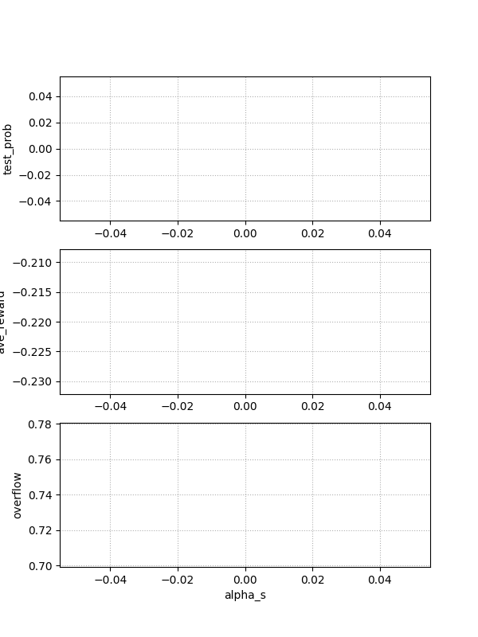

## data20220519_175417_main_HRC_agent_q
### Common config
```
hostname: pc-34
dir_path: data/data20220519_175417_main_HRC_agent_q
Report  : data20220519_175417_main_HRC_agent_q.md
Test    : None
Exe     : python3 main_HRC_agent_q.py 
parallel: 1
```
### Default Config
```
 columns:None
     csv:None
      id:None
    plot:0
    seed:0
train_episode_num:10
test_episode_num:10
show_env:0
is_minus:1
report_interval_train:50
report_interval_test:50
max_step_num:20
      NN:256
      Nu:16
      Nh:20
      Ny:4
    Temp:1.0
      dt:0.00390625
 alpha_i:0.6
 alpha_r:1
 alpha_b:0.0
 alpha_s:0.1
  beta_i:0.3
  beta_r:0.3
    ep_2:0.01
  ep_ini:0.01
  ep_fin:0.0
   eta_2:0.01
 eta_ini:0.1
 eta_fin:0
gamma_wout:0.9
k_greedy:0.005
test_prob:0
cnt_overflow:0
ave_reward:0
```
### Grid search 1D (alpha_s) 
1D grid search on alpha_s from 0.0 to 0.0 (1 points )

Data:**data20220519_175417_main_HRC_agent_q_scan1d_alpha_s.csv**  
Start:20220519_175417  
Done :20220519_175420  
Figure:** data20220519_175417_main_HRC_agent_q_scan1d_alpha_s.png **  
  
### Grid search 1D (beta_r) 
1D grid search on beta_r from 0.0 to 1.0 (41 points )

Data:**data20220519_175417_main_HRC_agent_q_scan1d_beta_r.csv**  
Start:20220519_175421  
